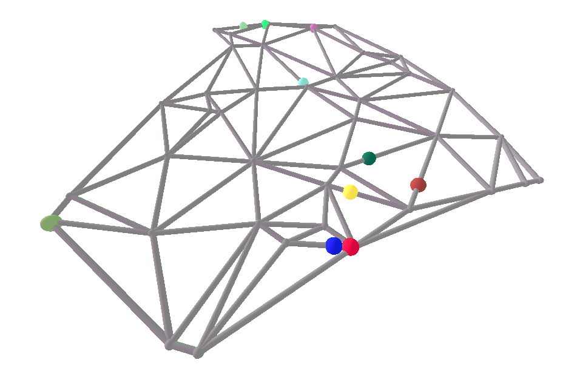

# Distributed Traffic Simulation

This project simulates a distributed traffic system featuring moving spheres on a randomly generated network. Developed as part of CPSC 5387 – Distributed Computing (Fall 2024), the project combines Python-based nodes for simulating car and sensor behavior with Godot for visualization.

## Features

- **Network Simulation**: Randomly generated road network.
- **Distributed Nodes**:
  - **Cars**: Nodes representing vehicles moving along the network.
  - **Sensors**: Nodes monitoring vehicle positions.
- **Visualization**: Real-time rendering of the simulation using Godot.

## Project Structure

```
├── python/
│   ├── cars.py       # Car node logic
│   ├── sensors.py    # Sensor node logic
├── godot/
│   ├── project.godot # Godot project file
│   ├── ...           # Other Godot scene and script files
├── shot.png          # Screenshot of the simulation
└── README.md         # This file
```

## Installation and Setup

1. **Python Nodes**:
   - Install dependencies: `pip install -r requirements.txt`
   - Run the car and sensor nodes:
     ```bash
     python python/cars.py
     python python/sensors.py
     ```

2. **Godot Visualization**:
   - Open the `godot/` folder in Godot 4.
   - Run the simulation scene.

## How It Works

- Cars move along the randomly generated network based on predefined logic.
- Sensors periodically report data about the cars' positions.
- The Godot visualization reflects the current state of the simulation in real time.

## Screenshot



## Acknowledgments

This project was inspired by distributed systems concepts and developed for academic purposes. 

**Instructor**: Nicholas Seward  
**Course**: CPSC 5387 – Distributed Computing, Fall 2024
